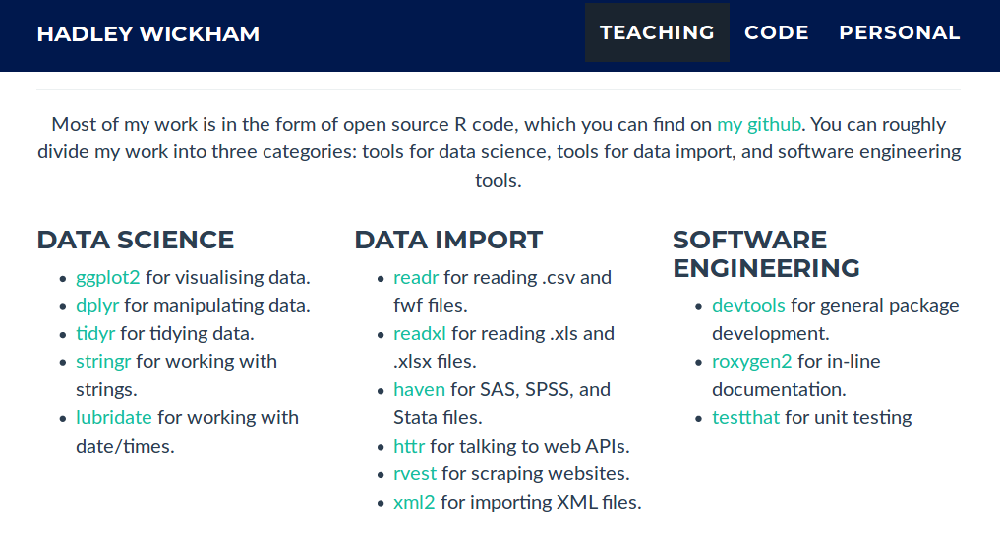
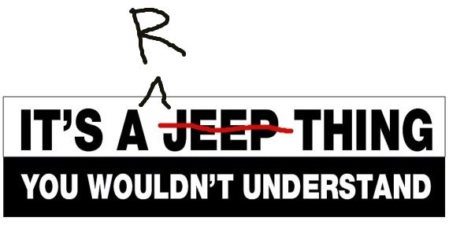
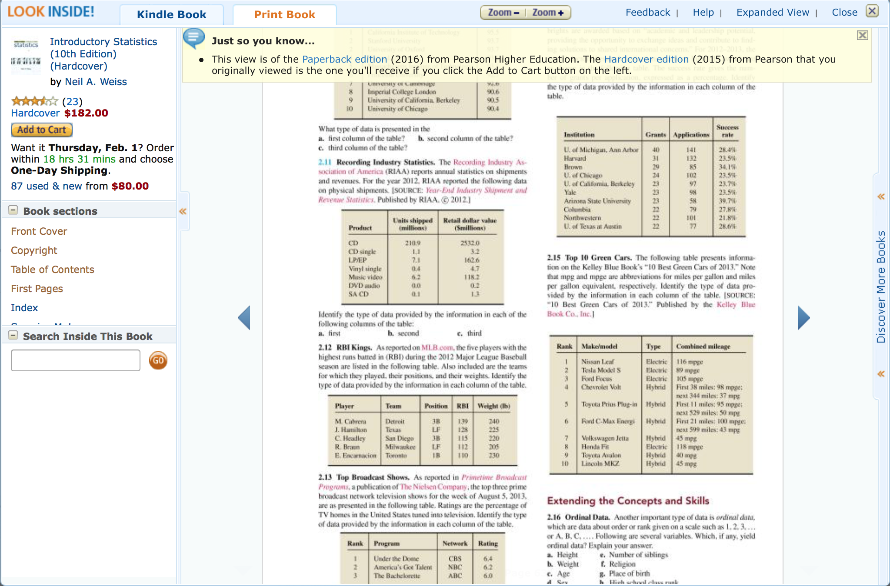
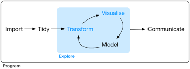

#### tidyverse

* data structure
* tool suite
* workflow


---

.pull-left[
  
]

.pull-right[
  
]


---

.center[
  
]


---

#### data structure: tidy data

* each variable in a column
* each observation in a row
* each value in a cell


---

.center[
  
]


---

#### Open an intro to ANY statistics textbook...

.center[
  
]

--

.center[
  ...and you will find that statistics (analysis, plotting - anything, really) starts once you have tidy data
]

.footer[D. Cook [To the Tidyverse and Beyond: Challenges for the Future in Data Science](bit.ly/rstudio-cook)]


---

#### workflow

.center[
  
]

"It is often said that 80% of data analysis is spent on the process of cleaning and preparing the data" _Dasu and Johnson 2003_


"All data are crap, it is just a matter of how much work you have to do to make them useful" _good ol' Ben_

.footer[[R for Data Science](https://r4ds.had.co.nz/)]


---

#### write for humans

"Programs must be written for people to read, and only incidentally for machines to execute." _Hal Abelson_

```r
new_thing <- thing %>%
  do something to thing %>%
  do something to thing %>%
  do something to thing
```
.footer[H. Wickham [Tidyverse](https://speakerdeck.com/hadley/tidyverse)]

---

#### tidyverse

.center[
  
]
